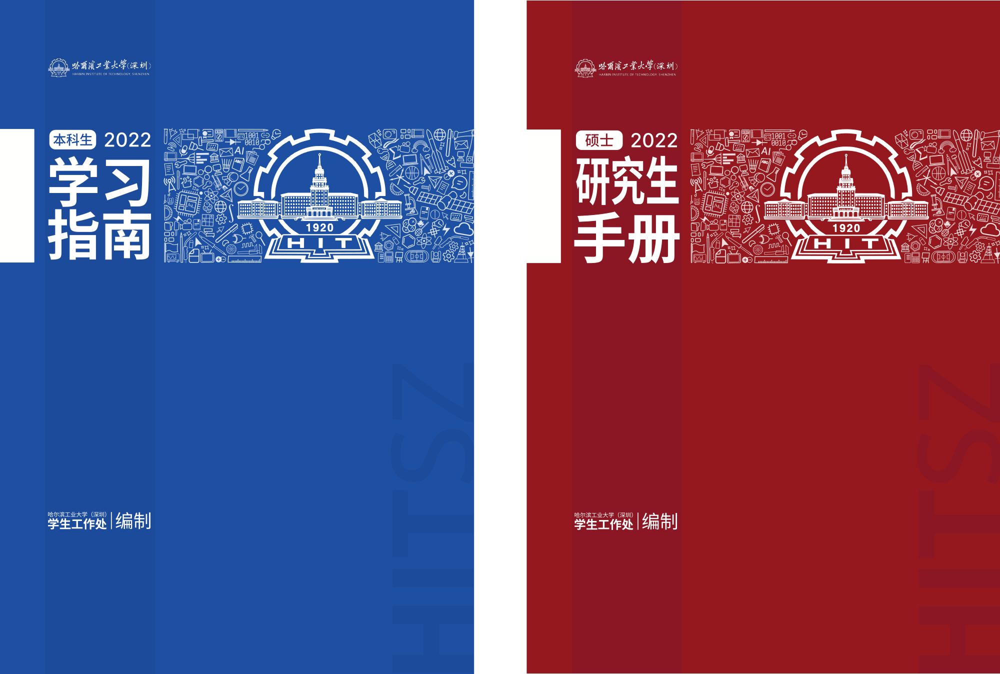

# 哈工大（深圳）2022 年学生手册封面设计参赛作品

这是一份哈工大深圳校区「2022 年学生手册封面设计」参选作品，包含《本科生学习指南》《硕士研究生手册》《博士研究生手册》三套封面（含封底）。

本作品获奖等级为「优秀奖」。

## 使用素材说明

本设计稿使用了下面的字体：

- 更纱黑体：标题字体
- Ubuntu：右下水印「HITSZ」
- Segoe Fluent Icons：部分小图案

哈尔滨工业大学校徽、校名题字，以及封底校训题字来源为网络公开内容。

上述所有素材之著作权若有归属，则归其作者和 / 或版权所有者所有。

## 许可证

© Hans WAN

本作品以 [CC BY-NC-SA 4.0 International](https://creativecommons.org/licenses/by-nc-sa/4.0/deed.zh) 许可。

